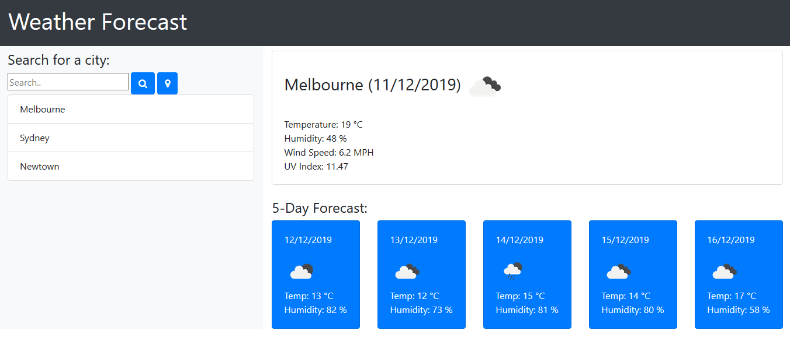

# Weather Forecast 

## Description 
This is a weather dashboard application with search functionality to find current weather conditions and the future weather outlook for multiple cities.

## Usage
1. Open this URL in your web browswer. 
https://tak-9.github.io/weather/

2. The browswer displays the pop-up to request geolocation permission. 
The weather for the current location is displayed, if you allow it.

3. Enter a city name in the text field and click icon (or press enter key) to search.  

4. Click the location icon to detect the current location and search. 

5. The search keywords are kept in the history box. Clicking the city name in history to search for weather. 

## Credit 
Open Weather API https://openweathermap.org/api
Moment.js https://momentjs.com/
jQuery https://jquery.com/
Bootstrap https://getbootstrap.com/
Font awesome 

## Screen Capture

